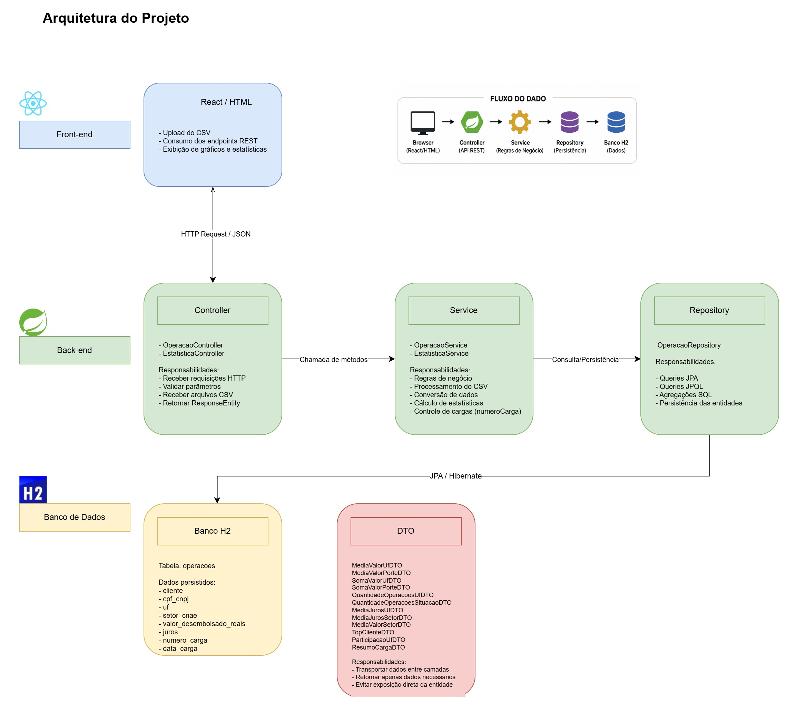

# FinData BNDES - Programação Orientada a Objetos Avançada - Projeto P2


## Integrantes

- [Gabriel Dinis Melo](https://github.com/GabrielDinisMelo)
- [Luiz Antonio de Jesus Cruz](https://github.com/ladjc)
___
## Objetivo

Aplicar os conhecimentos e habilidades desenvolvidas sobre Java Spring Boot durante o curso de Programação Orientada a Objetos Avançada ministrado pela Profa Mestre Sirley Ambrosia Vitorio Addão.

O sistema foi desenvolvido para auxiliar na análise e consulta de dados das operações de financiamentos do BNDES, transformando informações brutas disponibilizadas em arquivos CSV em indicadores estratégicos para apoio à tomada de decisão.

A aplicação permite importar bases de dados reais do BNDES contendo informações sobre as operações de financiamentos do BNDES, armazená-las em banco de dados H2 e realizar consultas analíticas através de end-points implementados com Spring Boot, aplicando conceitos de persistência com JPA/Hibernate e APIs REST com Spring Boot. 

As bases podem ser encontradas no [site de dados abertos do BNDES](https://dadosabertos.bndes.gov.br/dataset/operacoes-financiamento). (Operações indiretas automáticas)

Entre as funcionalidades implementadas estão estatísticas de média, soma, participação percentual, quantidade de operações e ranking de clientes, além do controle de múltiplas cargas por versionamento dos dados carregados.
___
## Arquitetura do Projeto
- [Back-end](./backend/)
- [Front-end](./frontend/)


___ 

## Entidades

A entidade principal do sistema é a classe [`Operacao`](/backend/src/main/java/br/com/fatec/findatabndesapi/model/Operacao.java), responsável por representar uma operação de financiamento do BNDES armazenada no banco de dados H2.

A classe utiliza a anotação `@Entity`, permitindo que o JPA/Hibernate realize o mapeamento objeto-relacional automaticamente. A tabela correspondente foi definida como `operacoes` através da anotação:

```java
@Table(name = "operacoes")
```
### Atributos da Entidade Operações

| Atributo                 | Tipo            | Descrição                                                               |
| ------------------------ | --------------- | ----------------------------------------------------------------------- |
| `id`                     | `Long`          | Identificador único da operação. Chave primária gerada automaticamente. |
| `cliente`                | `String`        | Nome do cliente ou empresa beneficiada pela operação financeira.        |
| `cpfCnpj`                | `String`        | CPF ou CNPJ do cliente associado à operação.                            |
| `uf`                     | `String`        | Unidade Federativa (estado) relacionada à operação.                     |
| `porteDoCliente`         | `String`        | Porte empresarial do cliente.                                           |
| `naturezaDoCliente`      | `String`        | Natureza jurídica do cliente da operação.                               |
| `setorCnae`              | `String`        | Setor econômico da operação baseado na classificação CNAE.              |
| `dataDaContratacao`      | `LocalDate`     | Data de contratação da operação financeira.                             |
| `valorDesembolsadoReais` | `BigDecimal`    | Valor desembolsado pelo BNDES em reais.                                 |
| `juros`                  | `Double`        | Taxa de juros aplicada à operação.                                      |
| `prazoAmortizacaoMeses`  | `Integer`       | Prazo de amortização em meses.                                          |
| `situacaoDaOperacao`     | `String`        | Situação atual da operação financeira.                                  |
| `numeroCarga`            | `Long`          | Número identificador da carga/importação do CSV.                        |
| `dataCarga`              | `LocalDateTime` | Data e horário em que a carga foi realizada.                            |

---
## Endpoints da API

### Operacao Controller
URL base: ` /operacoes `

| Método | URL | Descrição | Request Body | Exemplo de Retorno | HTTP |
|---|---|---|---|---|---|
| POST | `/operacoes/carga` | Realiza a carga de um arquivo CSV contendo operações do BNDES | ```json { "arquivo": "operacoes.csv" } ``` | ```text operacoes.csv carregado com sucesso. ``` | 200 |
| GET | `/operacoes/bases` | Lista todas as bases carregadas no sistema | Não possui | ```json [ { "dataCarga": "2026-05-21T16:51:46.443Z", "quantidadeOperacoes": 1200, "ncarga": 1 }, { "dataCarga": "2026-05-22T10:15:20.120Z", "quantidadeOperacoes": 980, "ncarga": 2 } ] ``` | 200 |
| DELETE | `/operacoes/carga/{nCarga}` | Remove todos os registros associados a uma carga específica | Não possui | ```text Registros da base 1 deletados. ``` | 200 |
| DELETE | `/operacoes/carga/{nCarga}` | Número da carga inválido | Não possui | ```text Número da base inválida. ``` | 404 |

---

### Estatistica Controller
URL base: `/estatisticas`
| Método | URL | Descrição | Request Body | Exemplo de Retorno | HTTP |
|---|---|---|---|---|---|
| GET | `/estatisticas/media-valor-uf?base=1` | Média do valor desembolsado por UF | Não possui | ```json [ { "uf": "SP", "mediaValor": 154000.55 }, { "uf": "RJ", "mediaValor": 98200.30 } ] ``` | 200 |
| GET | `/estatisticas/media-valor-porte?base=1` | Média do valor desembolsado por porte do cliente | Não possui | ```json [ { "porteDoCliente": "Grande", "mediaValor": 450000.75 }, { "porteDoCliente": "Micro", "mediaValor": 18000.10 } ] ``` | 200 |
| GET | `/estatisticas/media-valor-setor?base=1` | Média do valor desembolsado por setor CNAE | Não possui | ```json [ { "setorCnae": "Indústria", "mediaValor": 250000.45 }, { "setorCnae": "Serviços", "mediaValor": 92000.12 } ] ``` | 200 |
| GET | `/estatisticas/soma-valor-uf?base=1` | Soma dos valores desembolsados por UF | Não possui | ```json [ { "uf": "SP", "somaValor": 12000000.50 }, { "uf": "MG", "somaValor": 3500000.25 } ] ``` | 200 |
| GET | `/estatisticas/soma-valor-porte?base=1` | Soma dos valores desembolsados por porte do cliente | Não possui | ```json [ { "porteDoCliente": "Grande", "somaValor": 25000000.00 }, { "porteDoCliente": "Pequena", "somaValor": 2100000.90 } ] ``` | 200 |
| GET | `/estatisticas/quantidade-total-operacoes?base=1` | Quantidade total de operações | Não possui | ```json 15000 ``` | 200 |
| GET | `/estatisticas/quantidade-operacoes-uf?base=1` | Quantidade de operações por UF | Não possui | ```json [ { "uf": "SP", "quantidade": 5200 }, { "uf": "RJ", "quantidade": 2100 } ] ``` | 200 |
| GET | `/estatisticas/quantidade-operacoes-situacao?base=1` | Quantidade de operações por situação | Não possui | ```json [ { "situacaoDaOperacao": "Ativa", "quantidade": 12000 }, { "situacaoDaOperacao": "Encerrada", "quantidade": 3000 } ] ``` | 200 |
| GET | `/estatisticas/media-juros-geral?base=1` | Média geral de juros das operações | Não possui | ```json 6.75 ``` | 200 |
| GET | `/estatisticas/media-juros-uf?base=1` | Média de juros por UF | Não possui | ```json [ { "uf": "SP", "mediaJuros": 5.80 }, { "uf": "RJ", "mediaJuros": 6.10 } ] ``` | 200 |
| GET | `/estatisticas/media-juros-setor?base=1` | Média de juros por setor CNAE | Não possui | ```json [ { "setorCnae": "Comércio", "mediaJuros": 7.25 }, { "setorCnae": "Tecnologia", "mediaJuros": 4.90 } ] ``` | 200 |
| GET | `/estatisticas/top-clientes?base=1` | Clientes com maiores valores desembolsados | Não possui | ```json [ { "cliente": "Empresa XPTO", "totalDesembolsado": 12500000.75 }, { "cliente": "Indústria Alfa", "totalDesembolsado": 9800000.30 } ] ``` | 200 |
| GET | `/estatisticas/participacao-uf?base=1` | Participação percentual de cada UF no total desembolsado | Não possui | ```json [ { "uf": "SP", "percentual": 42.7 }, { "uf": "MG", "percentual": 18.4 } ] ``` | 200 |
